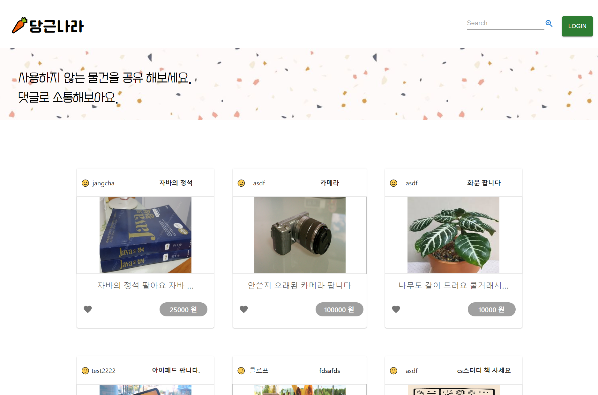
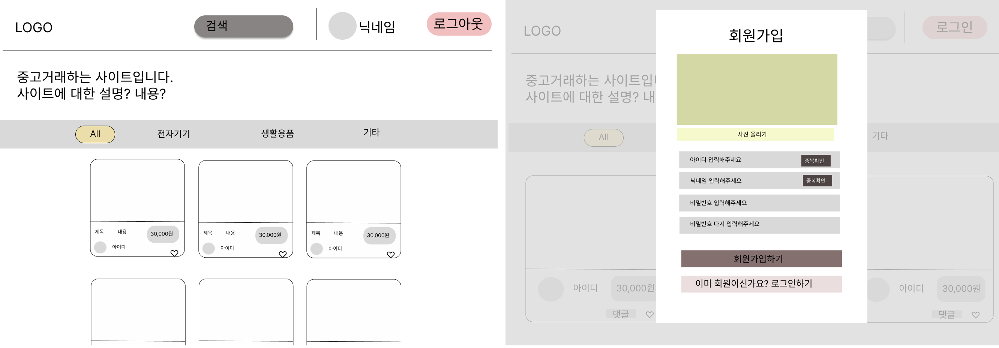
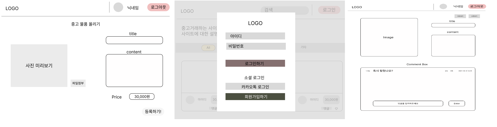

# 당근나라

사용하지 않는 물건을 공유하고 댓글로 소통하는 중고거래사이트입니다.
-----------------------------------------
</img> 
🟨[사이트 바로가기](https://carrotcountry.netlify.app/) 
🖥[시연영상보기]
 
 
 

### 개발기간
---------------------------------------------
2022.08.12 ~ 2022.08.18
 
 
 

### 당근나라 개발자들
---------------------------------------------
👉 BE : 이민규, 신선호, 장창균, 황인권 
👉 FE : 류현, 정민희
 
 
 
### 와이어프레임
----------------------------------------------------
</img> 
</img> 
 
 
 

### FrontEnd 기술 스택
-------------------------------------------
- React.Js
- Styled-component
- react-router-dom
- react-hook-form
- Redux
- Redux toolkit
- Axiox
 
 
 

### 기능
-------------------------------------------------------
1. 게시글
    * 목록 가져오기
    * 추가하기(이미지 업로드)
    * 삭제하기
    * 수정하기
2.  회원가입하기
3.  로그인하기
4.  댓글 CRUD
 
 
 

### 페이지별 상세 설명
----------------------------------------------------
1. 회원가입 페이지
  * 아이디, 닉네임, 비밀번호 형식 체크(유효성 검사)
  * 중복확인 체크
2. 로그인 페이지
  * 등록되어 있지 않은 아이디, 패스워드 로그인 차단
3. 메인 페이지(게시글 목록 페이지)
  * 게시글 목록 
  * 게시글마다 작성자의 닉네임, 업로드된 이미지, 제목, 내용 미리보기 구성
  * 게시글 개별 클릭시 상세 페이지로 이동
4. 상품 등록 페이지
  * 올릴 사진 미리보기
  * 사진 올려야 작성완료 
  * 작성완료시 alert 창과 메인페이지로 이동
5. 게시글 상세 페이지
  * 작성자만 수정, 삭제 가능
6. 댓글 
  * 작성자만 수정, 삭제 가능
 
 
 

### 초기설정
-------------------------------------------------
>$ yarn install   
$ yarn add react-router-dom    
$ yarn add styled-components   
$ yarn add redux react-redux redux-thunk redux-logger redux-actions redux-devtools-extension   
$ yarn add connected-react-router   
$ yarn add axios   
